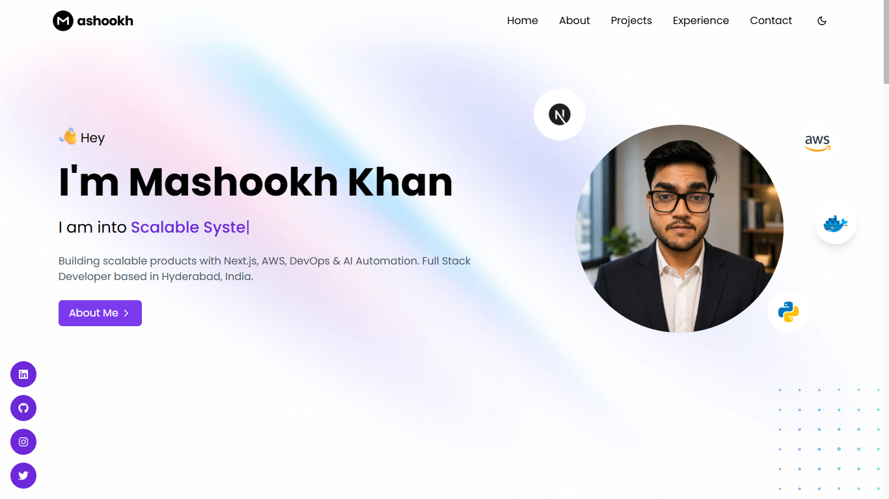
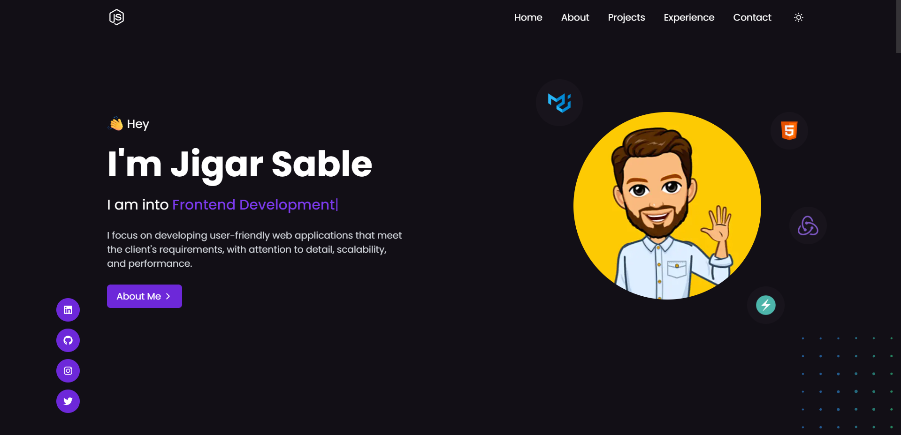

<div align="center">

# 🚀 Mashookh Khan — Developer Portfolio

**Full Stack Developer & DevOps Engineer** based in Hyderabad, India

[](https://nextjs.org/)
[](https://www.typescriptlang.org/)
[](https://tailwindcss.com/)
[](https://www.docker.com/)
[](LICENSE.md)

A modern, fully responsive, dark/light mode portfolio website built with Next.js 13 App Router. Content is data-driven via a single `data.json` file — no code changes needed to update your portfolio.

[Live Demo](https://jigarsable.vercel.app) · [Report a Bug](https://github.com/MashookhKhanlol/my-portfolio-next/issues) · [LinkedIn](https://www.linkedin.com/in/mashookh-khan-5a8a1024b)

---

### 🌞 Light Mode


### 🌙 Dark Mode


</div>

---

## 📋 Table of Contents

- [✨ Features](#-features)
- [🛠️ Tech Stack](#️-tech-stack)
- [📁 Project Structure](#-project-structure)
- [⚡ Quick Start](#-quick-start)
- [🔧 Configuration](#-configuration)
- [🐳 Docker](#-docker)
- [☁️ Deployment](#️-deployment)
- [🎨 Customization](#-customization)
- [📄 License](#-license)

---

## ✨ Features

- 🌗 **Dark / Light Mode** — Smooth theme toggle powered by `next-themes`
- ✍️ **Typewriter Animations** — Dynamic role cycling in the hero section
- 📨 **Working Contact Form** — Sends real emails via Gmail SMTP (Nodemailer)
- 📊 **Data-Driven Content** — All sections (hero, about, skills, projects, experience) powered by `data.json`
- 🔗 **Remote Data Support** — Optionally fetch `data.json` from a GitHub raw URL
- 🎞️ **Smooth Animations** — Page transitions and scroll reveals via Framer Motion
- 📱 **Fully Responsive** — Mobile-first layout with Tailwind CSS
- 🔍 **SEO Optimised** — Open Graph tags, Twitter Card, canonical URLs, structured headings
- 🐳 **Docker Ready** — Production-grade multi-stage Docker build included
- ⚡ **Vercel Ready** — Zero-config deployment to Vercel

---

## 🛠️ Tech Stack

| Layer | Technology |
|---|---|
| **Framework** | Next.js 13 (App Router) |
| **Language** | TypeScript 4.9 |
| **Styling** | Tailwind CSS 3 |
| **Animations** | Framer Motion 9 |
| **Icons** | React Icons |
| **Typewriter** | typewriter-effect |
| **Email** | Nodemailer + Gmail SMTP |
| **Database** | Firebase Realtime Database |
| **Analytics** | Vercel Analytics |
| **Scroll** | react-scroll |
| **Notifications** | react-toastify |
| **Containerization** | Docker + Docker Compose |

---

## 📁 Project Structure

```
next-portfolio/
├── app/                        # Next.js 13 App Router
│   ├── page.tsx                # Root page — fetches data, renders HomePage
│   ├── HomePage.tsx            # Shell that composes all sections
│   ├── Header.tsx              # Sticky nav with theme toggle
│   ├── Footer.tsx              # Footer with social links
│   ├── head.tsx                # SEO meta tags (OG, Twitter, canonical)
│   ├── layout.tsx              # Root layout
│   └── globals.css             # Global styles
│
├── components/                 # UI components
│   ├── Hero.tsx                # Hero section with typewriter & avatar
│   ├── About.tsx               # About me section
│   ├── Contact.tsx             # Contact form (posts to /api/mail)
│   ├── Socials.tsx             # Social links bar
│   ├── CallToAction.tsx        # CTA button
│   ├── SectionWrapper.tsx      # Reusable animated section wrapper
│   ├── skills/                 # Skills section components
│   ├── projects/               # Projects grid components
│   └── experiences/            # Experience & Education timeline
│
├── pages/api/
│   └── mail.ts                 # API route — sends email via Nodemailer
│
├── types/                      # TypeScript type definitions
├── public/                     # Static assets (images, favicon)
├── data.json                   # ⭐ All portfolio content lives here
├── firebase.ts                 # Firebase Realtime DB initialisation
├── next.config.js              # Next.js config (standalone output, image domains)
├── tailwind.config.js          # Tailwind theme config
├── Dockerfile                  # Multi-stage Docker build
├── docker-compose.yml          # Docker Compose for local/prod
├── .dockerignore               # Docker build context exclusions
├── .env.local                  # Local environment variables (git-ignored)
└── .env.local.example          # Template for required env vars
```

---

## ⚡ Quick Start

### Prerequisites

- **Node.js** ≥ 18
- **npm** ≥ 9
- **Docker** (optional, for containerised setup)

### 1. Clone the repository

```bash
git clone https://github.com/MashookhKhanlol/my-portfolio-next.git
cd my-portfolio-next
```

### 2. Install dependencies

```bash
npm install --legacy-peer-deps
```

### 3. Set up environment variables

```bash
cp .env.local.example .env.local
```

Open `.env.local` and fill in your values (see [Configuration](#-configuration)).

### 4. Run the development server

```bash
npm run dev
```

Open [http://localhost:3000](http://localhost:3000) in your browser.

---

## 🔧 Configuration

All environment variables are documented in [`.env.local.example`](.env.local.example).

### Required Variables

| Variable | Description |
|---|---|
| `GMAIL_USER` | Gmail address used to **send** contact form emails |
| `GMAIL_APP_PASSWORD` | 16-character [App Password](https://myaccount.google.com/apppasswords) (not your Gmail password) |

### Optional Variables

| Variable | Description | Default |
|---|---|---|
| `NEXT_PUBLIC_DATA_URL` | GitHub raw URL to fetch `data.json` remotely | Falls back to local `data.json` |
| `NEXT_PUBLIC_FIREBASE_*` | Firebase Realtime Database credentials | — |

### Setting up Gmail App Password

1. Go to your **Google Account → Security**
2. Enable **2-Step Verification** (required)
3. Search for **App Passwords**
4. Create a new App Password for "Mail"
5. Copy the 16-character code into `GMAIL_APP_PASSWORD`

> **⚠️ Security note:** Never commit `.env.local` to version control. It is already listed in `.gitignore`.

---

## 🐳 Docker

The project includes a **production-grade multi-stage Dockerfile** for containerised deployment.

### Architecture

```
Stage 1 — deps     : npm ci (clean dependency install)
Stage 2 — builder  : next build (compiles the app)
Stage 3 — runner   : lean Alpine image, non-root user, node server.js
```

### Build & Run with Docker Compose

```bash
# Build the image and start the container
docker compose up --build

# Run in detached (background) mode
docker compose up -d --build

# Stop the container
docker compose down

# View logs
docker compose logs -f portfolio
```

The app will be available at **http://localhost:3000**.

### Environment Variables for Docker

Docker Compose reads your `.env.local` file automatically via `env_file`. For production environments, pass secrets via your CI/CD system instead:

```bash
docker compose up --build \
  -e GMAIL_USER=you@gmail.com \
  -e GMAIL_APP_PASSWORD=xxxx-xxxx-xxxx-xxxx
```

> **Note:** `NEXT_PUBLIC_*` variables are baked into the JavaScript bundle **at build time** as Docker `ARG`s. They must be set before building the image.

### Build the image standalone

```bash
docker build \
  --build-arg NEXT_PUBLIC_DATA_URL=https://raw.githubusercontent.com/... \
  -t next-portfolio:latest .
```

---

## ☁️ Deployment

### Vercel (Recommended)

1. Push your repository to GitHub
2. Import the project at [vercel.com/new](https://vercel.com/new)
3. Add environment variables in the Vercel dashboard:
   - `GMAIL_USER`
   - `GMAIL_APP_PASSWORD`
   - `NEXT_PUBLIC_DATA_URL` *(optional)*
   - Firebase vars *(optional)*
4. Deploy — Vercel auto-detects Next.js

### Other Platforms (Railway, Render, AWS EC2, etc.)

Use the Docker image:

```bash
# Build
docker build -t next-portfolio .

# Run
docker run -p 3000:3000 \
  -e GMAIL_USER=you@gmail.com \
  -e GMAIL_APP_PASSWORD=your-app-password \
  next-portfolio
```

---

## 🎨 Customization

All portfolio content is stored in a single file: **[`data.json`](data.json)**

You can edit it directly, or host it on GitHub and point `NEXT_PUBLIC_DATA_URL` to the raw URL so your live site updates without redeployment.

### Sections in `data.json`

| Key | What it controls |
|---|---|
| `main` | Name, short bio, typewriter titles, avatar, tech stack icons |
| `about` | About section image, bio text, resume URL, call URL |
| `socials` | Social media links (LinkedIn, GitHub, Instagram, Twitter) |
| `skills` | Skill cards with name, image, and category |
| `projects` | Project cards with name, stack, description, and links |
| `experiences` | Work experience timeline |
| `educations` | Education timeline |

### Adding a New Skill

```json
{
  "name": "Rust",
  "image": "https://img.icons8.com/color/144/null/rust-programming-language.png",
  "category": "Languages"
}
```

### Adding a New Project

```json
{
  "name": "My New Project",
  "techstack": "Next.js, TypeScript, PostgreSQL",
  "category": "Full Stack",
  "duration": "Jan 2026 - Mar 2026",
  "image": "https://images.unsplash.com/photo-xxx",
  "desc": "Project description goes here.",
  "links": {
    "code": "https://github.com/you/repo",
    "video": "",
    "visit": "https://your-project.vercel.app"
  }
}
```

### Theme & Colors

Colors and fonts are configured in [`tailwind.config.js`](tailwind.config.js). The primary accent color is **violet (`#7c3aed`)**.

---

## 📜 Available Scripts

| Script | Description |
|---|---|
| `npm run dev` | Start local development server on port 3000 |
| `npm run build` | Build the production bundle |
| `npm run start` | Start the production server |
| `npm run lint` | Run ESLint |

---

## 📄 License

This project is licensed under the **MIT License** — see the [LICENSE.md](LICENSE.md) file for details.

---

<div align="center">

Made with ❤️ by **Mashookh Khan**

[](https://www.linkedin.com/in/mashookh-khan-5a8a1024b)
[](https://github.com/MashookhKhanlol)
[](https://x.com/mashookh_a_k)

</div>
